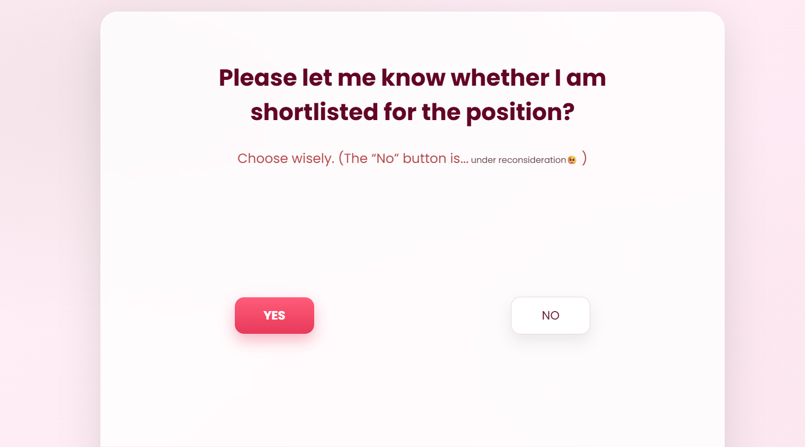
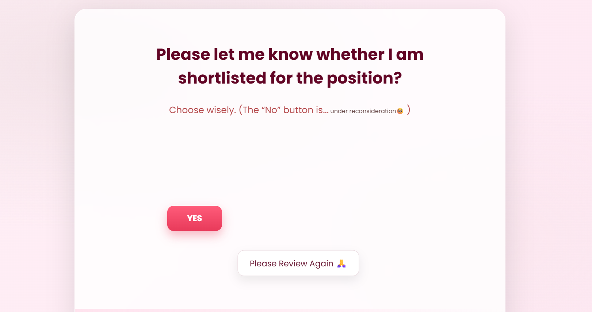
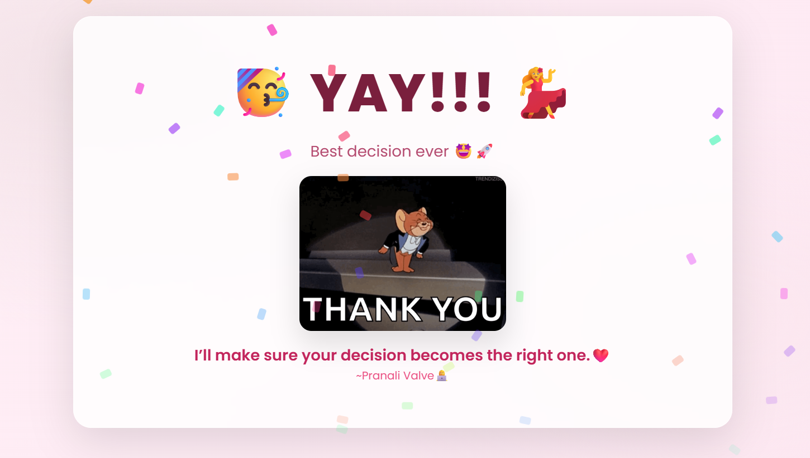

# Interactive Hiring Mail UI 💌

A creative and interactive frontend project built using HTML, CSS, and JavaScript.  
This project simulates a fun Gmail-style hiring interface with animations, responsive design, tooltips, confetti effects, and dynamic button interactions.

---

## ✨ Features

- 📧 Gmail-style UI Design
- 🎨 Clean & Responsive Interface
- 🎉 Confetti Celebration Effect
- 😆 Escaping “No” Button
- 💬 Dynamic HR-style Tooltips
- 📱 Mobile Responsive Design
- ⚡ Interactive JavaScript Effects

---

## 🚀 Technologies Used

- HTML5
- CSS3
- JavaScript

---

## 📸 Preview




---

## 🛠️ Project Structure

```bash
Interactive-Hiring-Mail-UI/
│
├── index.html
├── style.css
└── script.js
```

---

## 🌐 Live Demo

[Click Here To View Project](YOUR_NETLIFY_LINK_HERE)

---

## 💡 Learning Concepts

- DOM Manipulation
- Event Listeners
- Animations & Transitions
- Responsive Design
- Interactive UI Design
- JavaScript Random Positioning

---

## 👩‍💻 Author

Pranali Valve

- GitHub: https://github.com/pranali-valve
- LinkedIn: https://www.linkedin.com/in/pranali-valve-aa04b3382/

---

## ⭐ If You Like This Project

Give this repository a star ⭐
